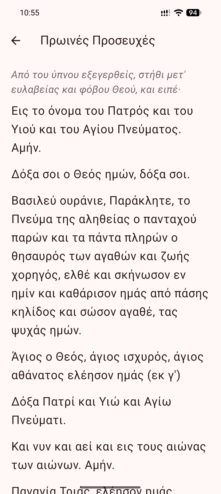

# Orthodox Prayer · Προσευχητάριον

<div align="center">
<a href="https://play.google.com/store/apps/details?id=io.github.prosefchi.prosefchi">

</a>
<a href="https://apps.obtainium.imranr.dev/redirect.html?r=obtainium://add/https://github.com/Prosefchi/prosefchi">

</a>
</div>

<div align="center">
<sub>
Google Play is a closed beta for now. Join the
<a href="https://groups.google.com/g/prosefchi">testers group</a>, then
<a href="https://play.google.com/apps/testing/io.github.prosefchi.prosefchi">opt in</a>
and that link will open. Obtainium works for everyone.
</sub>
</div>

A Greek Orthodox daily prayer app for Android and iOS. It shows the day's
commemoration and appointed readings, holds the prayer rules, and can remind you
to fast and pray.

The following languages are supported:

| Language       | Supported |
| -------------- | --------- |
| Koine Greek    | **Full**  |
| Modern English | **Full**  |

Either calendar can be chosen in settings: the new (Revised Julian) calendar the
Archdiocese publishes, or the old (Julian) one. Both keep Pascha and everything
counted from it on the same day, so Great Lent, Holy Week, the tone and the
eothinon are shared; only the fixed feasts move, falling thirteen days later on
the old calendar. The old calendar is English only, since its source publishes
English only.

## Screenshots

<div align="center">



</div>

## Website

The same day and the same prayers are on the web at
<https://prosefchi.org/>, in both languages. It installs as a web app and the
prayers stay readable offline, for anyone who cannot use the Android app.

It is a static site built from this repository by `tool/build_site.dart`, and it
runs the app's own code: the prayers are rendered through the same parser the
app uses, and the Paschalion, tone, eothinon and fasting seasons are the same
Dart compiled to JavaScript. To work on it:

```bash
dart run tool/build_site.dart --serve
```

That builds into `build/site`, downloads the published calendar so there is real
data to look at, serves it at <http://localhost:8000>, and rebuilds and reloads
whenever a source file changes. It shows the new calendar only.

## Building

```bash
flutter pub get
flutter run
```

Requires Flutter 3.44 or later.

## Calendar

Saints, feasts and readings come from the calendar published by the
[Greek Orthodox Archdiocese of America](https://www.goarch.org/), fetched and
republished as JSON by a daily GitHub Actions run:

- `https://prosefchi.github.io/prosefchi/calendar.en.gregorian.json`
- `https://prosefchi.github.io/prosefchi/calendar.el.gregorian.json`
- `https://prosefchi.github.io/prosefchi/calendar.en.julian.json`

The Archdiocese publishes the new calendar only, so the old calendar is built
from [orthocal.info](https://orthocal.info/), which computes both reckonings.

The app fetches whichever file matches the chosen language and calendar, and
keeps a copy on the device. To rebuild them locally:

```bash
dart run tool/build_calendar.dart
```

The Paschalion, the Octoechos tone, the eothinon and the fasting seasons are
also computed on the device, from the date alone. Where the published calendar
states one of them it is preferred; the computation is what the app falls back
on for the dates that calendar may not publish.

### How those are computed

Everything derives from the date of Pascha, which
`lib/liturgics/paschalion.dart` computes with Meeus's Julian algorithm. It
yields a Julian calendar date which is then converted to Gregorian, and that
conversion is why Orthodox and Western Easter usually differ.

The movable feasts are day offsets from Pascha, and the two weekly cycles count
from one of them: the tone through the eight from Thomas Sunday, the eothinon
through the eleven from the Sunday of All Saints. Both anchors were checked
against the published calendar rather than assumed, and each matched every day
it states one.

A day fasts if it is one of the few that always do, or falls in a fasting
season, or is a Wednesday or Friday outside a fast-free week. The seasons are
anchored partly to Pascha and partly to the civil calendar, which is where the
two reckonings diverge: the Apostles' Fast ends on a fixed date, so it is
thirteen days longer on the old calendar and cannot be erased by a late Pascha
as it can on the new one.

That is only whether a day fasts. What may be eaten varies with the season, the
weekday and the rank of the feast, and comes from the published calendar.
Against its rules the computed seasons agree on all 3287 days it covers.

## Licence

[GNU AGPL v3](LICENSE).

Calendar content belongs to the Greek Orthodox Archdiocese of America and to
orthocal.info, and is not covered by that licence.
