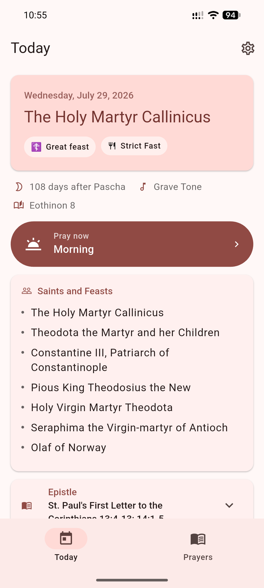
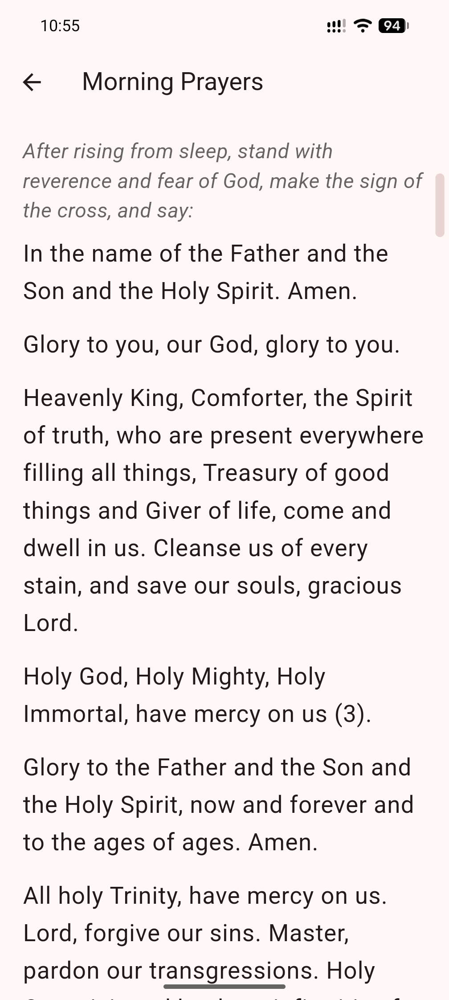
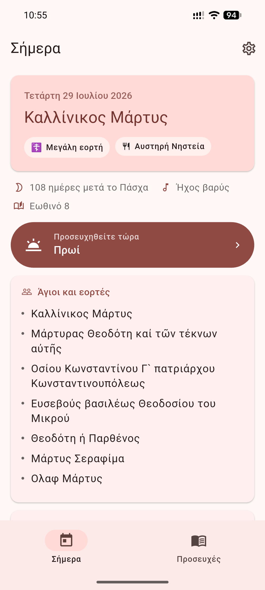

# Orthodox Prayer · Προσευχητάριον

<div align="center">
<a href="https://apps.obtainium.imranr.dev/redirect.html?r=obtainium://add/https://github.com/Prosefchi/prosefchi">

</a>
</div>

A Greek Orthodox daily prayer app for Android and iOS. It shows the day's
commemoration and appointed readings, holds the prayer rules, and can remind you
to fast and pray.

The following languages are supported:

| Language       | Supported |
| -------------- | --------- |
| Koine Greek    | **Full**  |
| Modern English | **Full**  |

## Screenshots

<div align="center">




</div>

## Building

```bash
flutter pub get
flutter run
```

Requires Flutter 3.44 or later.

## Calendar

Saints, feasts and readings come from the calendar published by the
[Greek Orthodox Archdiocese of America](https://www.goarch.org/), fetched and
republished as JSON by a daily GitHub Actions run:

- `https://prosefchi.github.io/prosefchi/calendar.en.json`
- `https://prosefchi.github.io/prosefchi/calendar.el.json`

The app fetches those and keeps a copy on the device. To rebuild them locally:

```bash
dart run tool/build_calendar.dart
```

The Paschalion, the Octoechos tone, the eothinon and the fasting seasons are
also computed on the device, from the date alone. Where the published calendar
states one of them it is preferred; the computation is what the app falls back
on for the dates that calendar may not publish.

### How those are computed

Everything derives from the date of Pascha, which
`lib/liturgics/paschalion.dart` computes with Meeus's Julian algorithm. It
yields a Julian calendar date which is then converted to Gregorian, and that
conversion is why Orthodox and Western Easter usually differ.

The movable feasts are day offsets from Pascha: Clean Monday at -48, Thomas
Sunday at +7, Pentecost at +49. The two weekly cycles count from one of them:

- Tone: weeks since Thomas Sunday, cycling through the eight.
- Eothinon: weeks since the Sunday of All Saints, cycling through the eleven.

No tone is shown during Bright Week, when the Octoechos is set aside and every
day has its own proper texts. Between Pascha and All Saints the eothinon follows
the previous year's cycle.

Both anchors were checked against the published calendar rather than assumed. It
states a tone on 86 days and an eothinon on 84. Thomas Sunday matched all 86 and
All Saints all 84, and the other plausible anchors matched none.

Whether a day fasts is resolved in four steps:

1. Some days fast whatever else is true: the Beheading, the Exaltation, and the
   eves of the Nativity and of Theophany.
2. The fast-free weeks lift the fast completely: Bright Week, the week after
   Pentecost, the week following the Publican and the Pharisee, and
   Christmastide.
3. The fasting seasons fast, some anchored to Pascha and some to the civil
   calendar. The Apostles' Fast begins the day after All Saints but always ends
   on 28 June, so its length varies with Pascha and a late enough Pascha removes
   it entirely.
4. Whatever is left fasts on Wednesdays and Fridays.

That is only whether a day fasts. What may be eaten varies with the season, the
weekday and the rank of the feast, and comes from the published calendar.
Against its rules the computed seasons agree on all 3287 days it covers.

## Licence

[GNU AGPL v3](LICENSE).

Calendar content belongs to the Greek Orthodox Archdiocese of America and is not
covered by that licence.
